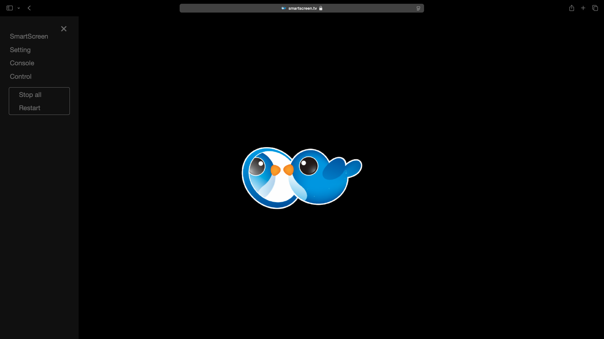
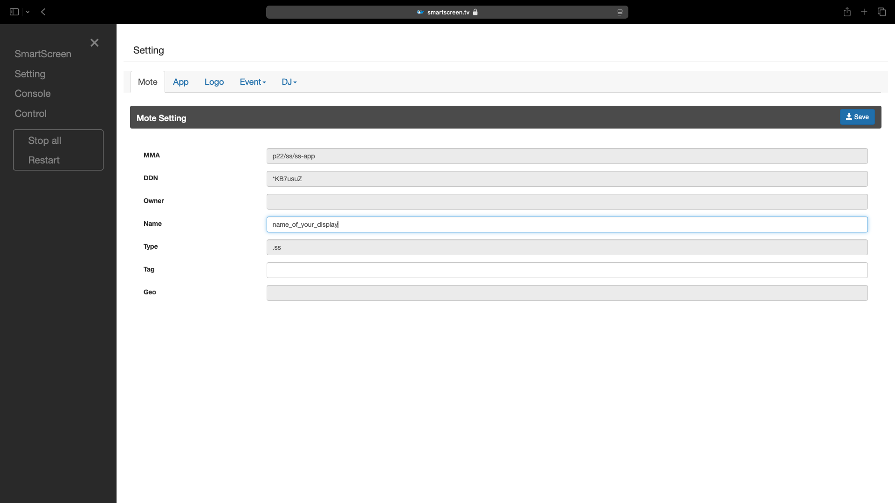
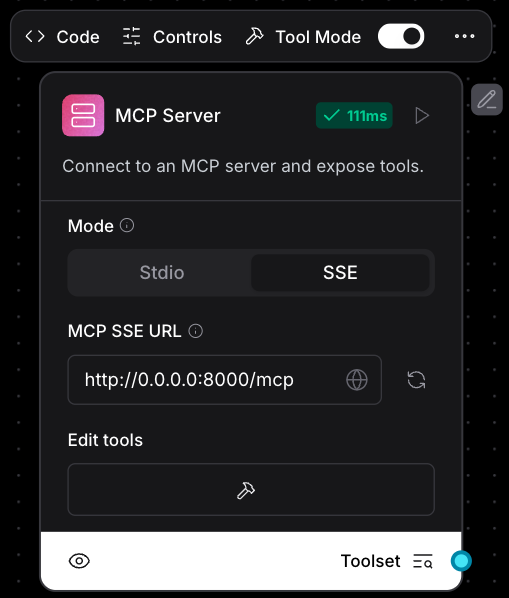

A FastAPI-based MCP server that integrates with [SmartScreen](#smartscreen-setup), allowing programmatic control of web displays (e.g., display media, send notifications, control playback) via simple HTTP/MCP commands.

---

## Table of Contents

1. [Prerequisites](#prerequisites)
2. [Installation](#installation)

   * [Local Setup](#local-setup)
   * [Docker](#docker)
3. [Configuration](#configuration)
4. [API Endpoints](#api-endpoints)
5. [SmartScreen Setup](#smartscreen-setup)
6. [MCP Tool Integration](#mcp-tool-integration)
7. [MCP Proxy for Clients Without SSE Support](#mcp-proxy-for-clients-without-sse-support)
8. [Langflow Integration](#langflow-integration)
9. [Contributing](#contributing)

---

SmartScreen setup:
1. Access SmartScreen through URL: smartscreen.tv  

   * On Linux, SmartScreen can be installed via snapcraft.
2. Click the menu button on the top-left corner to reach 
**Settings**. Here you can name your device, add tags, and set up OnStart and other scheduled events.  

   * Don’t forget to click “Save” after making any changes.

## Prerequisites

* Python 3.12+
* Docker (optional, for containerized deployment)
* `YOUTUBE_API_KEY` (YouTube Data API v3 key)
* `SS_SERVICE_TOKEN` (SmartScreen service token)

## Installation

### Local Setup

1. Clone the repository:

   ```bash
   git clone <repo_url>
   cd ultra/mcp-ss
   ```

2. Install dependencies:

   ```bash
   pip install -r requirements.txt
   ```

3. Run the server:

   ```bash
   uvicorn main:app --reload --host 0.0.0.0 --port 8000
   ```

### Docker

1. Build the image:

   ```bash
   docker build -t ultra-mcp-ss .
   ```
2. Run the container:

   ```bash
   docker run -d --name ultra-mcp-ss -p 127.0.0.1:8000:8000 ultra-mcp-ss
   ```

## Configuration

Create a `.env` file in the project root or export environment variables:

```dotenv
YOUTUBE_API_KEY=AIzaSy...
SS_SERVICE_TOKEN=xxxxx
```

Or via shell:

```bash
export YOUTUBE_API_KEY=AIzaSy...
export SS_SERVICE_TOKEN=xxxxx
```

## API Endpoints

Base URL: `http://127.0.0.1:8000`

### Health & Search

| Endpoint              | Method | Description                           |
| --------------------- | ------ | ------------------------------------- |
| `HEAD /mcp`           | HEAD   | Health check for MCP                  |
| `GET /search-youtube` | GET    | Returns the most relevant YouTube URL |

### SmartScreen Commands (HTTP)

| Endpoint   | Method | Description                                      |
| ---------- | ------ | ------------------------------------------------ |
| `/drop`    | POST   | Drop media URL onto a screen frame               |
| `/notify`  | POST   | Send a notification banner                       |
| `/toast`   | POST   | Show a toast popup message                       |
| `/marquee` | POST   | Display scrolling marquee text                   |
| `/text`    | POST   | Render static text overlay                       |
| `/app`     | POST   | Launch a web app in a frame                      |
| `/touch`   | POST   | Send playback/control commands                   |
| `/status`  | POST   | Query or set system status                       |
| `/dj`      | POST   | Execute DJ tasks (scheduling, kiosk, logo, etc.) |

For detailed schemas and models, visit the OpenAPI docs: `http://<host>:8000/docs`

## SmartScreen Setup

SmartScreen is a web-based display service. To configure your device:

1. Access the dashboard at: `https://smartscreen.tv`
   
2. Open **Settings** (menu ☰):

   * Name your device
   * Add tags
   * Configure **OnStart** and other scheduled events
   * Click **Save**
     
3. Return to the Home Page to see your device online.

## MCP Tool Integration

By default, FastApiMCP mounts all commands under `/mcp`. Use any MCP client to invoke tools by name (e.g., `drop`, `notify`, `toast`).

## MCP Proxy for Clients Without SSE Support

For clients that lack native SSE, such as Claude Desktop:

1. Install `mcp-proxy`:

   ```bash
   # Python
   pip install mcp-proxy

   # Node.js
   npm install -g mcp-proxy
   pnpm add -g mcp-proxy
   ```
2. Configure `claude_desktop_config.json`:

   **Windows**

   ```json
   {
     "mcpServers": {
       "ultra-mcp-ss": {
         "command": "mcp-proxy",
         "args": ["http://0.0.0.0:8000/mcp"]
       }
     }
   }
   ```

   **macOS**

   ```bash
   which mcp-proxy  # find install path
   ```

   ```json
   {
     "mcpServers": {
       "ultra-mcp-ss": {
         "command": "/path/to/mcp-proxy",
         "args": ["http://0.0.0.0:8000/mcp"]
       }
     }
   }
   ```

## Langflow Integration

To use `ultra/mcp-ss` in Langflow:

1. Add the **MCP Server** component from the **Tools** section.
2. Enable **Tool Mode**.
3. Select **SSE Mode** for real-time updates.
4. Set the URL to `http://0.0.0.0:8000/mcp`.
5. Run the component and execute SmartScreen commands within your flows.

<p align="center">
  
</p>

## Contributing

1. Fork the repository
2. Create a feature branch: `git checkout -b feature/my-feature`
3. Commit changes and push: `git push origin feature/my-feature`
4. Open a Pull Request for review.

---

> Made with FastAPI & FastApiMCP

